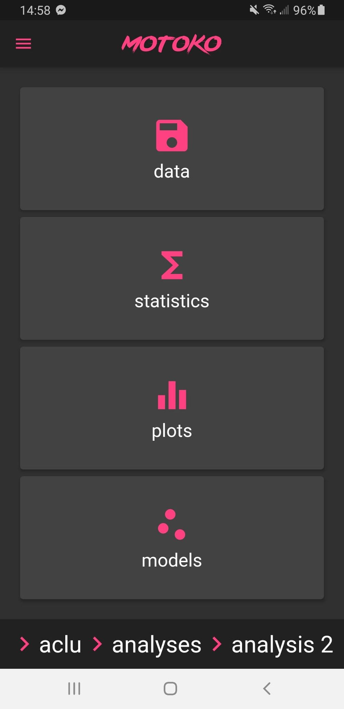
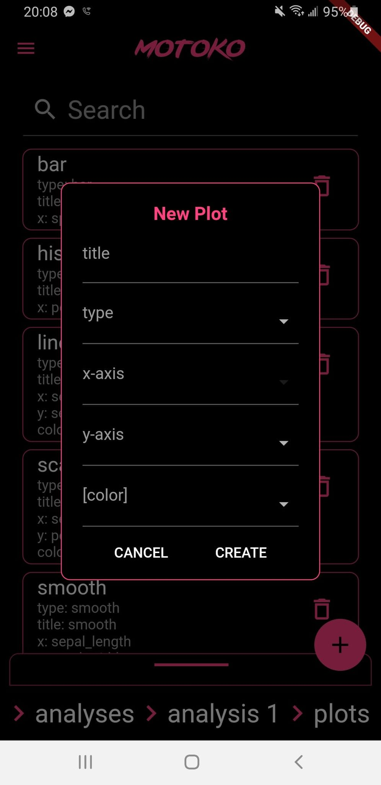
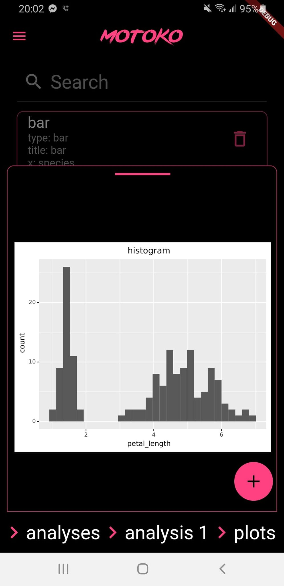
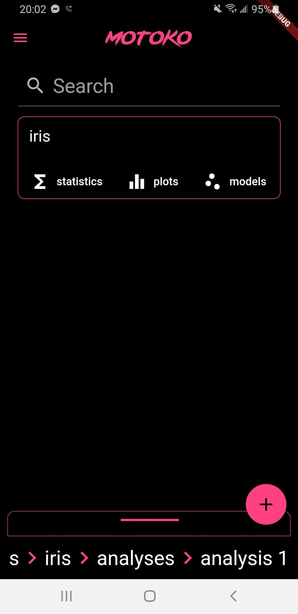

# motoko

> I'll have my AI analyze the data.

## Graduate Schools

The following are links to relevant parts of codebase:

- [Modeling](backend/py/plot)
- [Plotting](backend/py/plot)
- [Statistics](backend/py/statistic)
- [API and databases](backend/rs/graphql)
- [iOS and Android](frontend)
- [Administration and Deployment](motoko/src/main.rs)

## Overview

Motoko is an app that can plot, model, preview, and analyze datasets from iOS or
Android.

The frontend is written in Dart using the Flutter framework and can be compiled
to iOS, Android, Linux, and the Web.

The backend is written in Rust and Python. Rust is used for database management
and AWS Lambda functions. Python is used for plotting and machine learning
models.

An AWS RDS database (PostgreSQL) stores all of the data.

Local setup, data models, deployment, authentication and authorization, app
signing, and network topography are detailed below.

There is a also a binary written in Rust that performs the various
administrative and deployment commands called `motoko`, which can be installed
with `./install_motoko_command`.

## Screenshots

  
   
  
  
  

## TODO

- iOS deployment
  - test flight
  - apple login
  - motoko-garbage-collect from cli
- plotting:
  - custom theme
  - log transforms
- UI:
  - renaming - create `rename_node` mutation
  - dropdown menus
- copy references from parents if possible:
  - reverse dependency -> dataviews point to assets, add gc cleanup of assets
    - search in parents? can get complex
    - copy to children? what happens if middle child creates a new asset?
  - plots
  - statistics
  - models
- errors:
  - add errors in stats, plots, functions
  - custom errors from lambda or API gateway if it doesn't even load
  - separate error messages for dev vs prod:
    - https://doc.rust-lang.org/reference/conditional-compilation.html
    - https://doc.rust-lang.org/beta/rustc/command-line-arguments.html
- dev ops:
  - create test databases for cloudbuild unittests
  - dev tier adds to event object, enabling features
  - setup [RDS Proxy](https://aws.amazon.com/blogs/compute/using-amazon-rds-proxy-with-aws-lambda/)
  - get rights to Motoko font for mobile apps too
- auth:
  - google auth submit for review
  - apple submit for review
- bugs:
  - form builder typeahead: https://github.com/danvick/flutter_form_builder/issues/674
  - fix sliding up panel: https://github.com/akshathjain/sliding_up_panel/issues/193
    - fix hack for preview, adding 140 bottom pixels
  - async SAM invoke: https://github.com/aws/aws-sam-cli/pull/749
  - SAM invoke rust: https://github.com/aws/aws-lambda-runtime-interface-emulator/issues/11
  - Tokio-3 AWS Lambda - remove all .compat()
  - [truncated text on mobile web](https://github.com/flutter/flutter/issues/63467)

## Product

- Marketplace for canned analyses?
- Data adapters?
- Tools like hedonometer

## Local Setup

#### General

- `motoko` command
  - `curl --proto '=https' --tlsv1.2 -sSf https://sh.rustup.rs | sh`
  - `./install_motoko_command`
- lambdas:
  - macOS:
    - `brew install filosottile/musl-cross/musl-cross`
    - `ln -s /usr/local/bin/x86_64-linux-musl-gcc /usr/local/bin/musl-gcc`
  - arch:
    - `sudo pacman -S musl # required to compile rust lambdas`
- AWS:
  - `motoko install aws`
  - `aws configure`
    - [Users -> danj -> Security credentials](https://console.aws.amazon.com/iam/home#/users)
    - [Regions](https://docs.aws.amazon.com/general/latest/gr/rande.html)
      (default to `us-west-1`, which is Northern California)
    - output format: `json`
  - `sudo pacman -S docker # required for SAM`
  - `systemctl enable docker && systemctl start docker`
  - `sudo usermod -a -G docker danj # requires reboot`
- flutter:
  - `motoko run setup-android-keystore`
  - `motoko install flutter`
  - android
    - `android-studio # install SDKs`
      - install command line tools
      - install dart and flutter plugins
      - `flutter doctor`
        - `flutter config --android-studio-dir /opt/android-studio`
  - iOS
    - install XCode
- add [sqlx cli](https://github.com/launchbadge/sqlx/tree/master/sqlx-cli):
  - `cargo install --version=0.2.0 sqlx-cli --no-default-features --features postgres`
- postgres:
  - macOS:
    - `brew install postgres`
    - enable connections from Docker using AWS SAM:
      - `vim /usr/local/var/postgres/postgresql.conf`
        - `listen_addresses = '*'`
        - `port = 5432`
      - `vim /usr/local/var/postgres/pg_hba.conf`
        - `host all all 172.17.0.1/16 trust`
    - `psql -d postgres`
    - `CREATE USER postgres SUPERUSER`
    - `pg_ctl restart -D /usr/local/var/postgres`
    - `brew services postgres start`
  - arch:
    - `pacman -S postgresql`
    - `sudo -iu postgres`
    - `initdb -D /var/lib/postgres/data`
    - enable connections from Docker using AWS SAM:
      - `vim /var/lib/postgres/data/postgresql.conf`
        - `listen_addresses = '*'`
      - `vim /var/lib/postgres/data/pg_hba.conf`
        - `host all all 172.17.0.1/16 trust`
    - `systemctl enable postgresql`
    - `systemctl start postgresql`
    - `psql -U postgres` or `backend/rs/graphql/connect_to_db.sh`
  - `CREATE USER motoko WITH PASSWORD '<password>' # check .env file`
  - `CREATE DATABASE motoko_data`
  - `CREATE DATABASE motoko_meta`
  - `GRANT ALL PRIVILEGES ON DATABASE motoko_data TO motoko;`
  - `GRANT ALL PRIVILEGES ON DATABASE motoko_meta TO motoko;`
  - `motoko run reset-databases (local|remote)`
- run AWS SAM from `motoko/backend`:
  - `sam local start-lambda`
    - if you get `[Errno 28] No space left on device`, you need to increase
      your /tmp directory as detailed [here](https://wiki.archlinux.org/index.php/tmpfs)
    - can also temporarily run: `sudo mount -o remount,size=20G,noatime /tmp`
  - Note that on Linux, the host IP is 172.17.0.1; calls from a rust test must
    call lambda functions at 127.0.0.1:3001, but calls back to host from those
    lambda functions must go through 172.17.0.1
  - To test locally, run `motoko build sam`; the lambda functions need to be
    built in order to be called by other testing scripts

#### [Databases](https://us-west-1.console.aws.amazon.com/rds/home?region=us-west-1#database:id=motoko-free-tier;is-cluster=false)

##### AWS RDS creation:

- Create new db
  [here](https://us-west-1.console.aws.amazon.com/rds/home?region=us-west-1#)
- Make sure `public accessibility` option is set to `Yes`
- Make sure you assign a security group that permits TCP traffic to port 5432,
  like [this](https://us-west-1.console.aws.amazon.com/ec2/v2/home?region=us-west-1#SecurityGroups:search=motoko-free-tier)

#### Simulators

##### Android

- `motoko run emulator {android,ios,web}`
- `frontend $ flutter run`
- if you get `PlatformException...ApiException: 10`, see App Signing section
- if you get an out of date Google Play Services:
  - sign in on device
  - go to Google Play
  - Settings
  - click Play Store version to update

## Infrastructure

- Frontend uses [flutter](https://flutter.dev/), which is written in dart, here
  is the [style guide](https://dart.dev/guides/language/effective-dart/style)
- Backend uses API Gateway and Lambda Functions; most code is written in rust
  or python

## Data Models

#### Creating a Migration

- `sqlx migrate add <name> # fill out in migrations/<name>.sql`
- `cargo sqlx prepare -- --lib # recompile static type checking`

## Deployment

- automatic deployment for the `dev` and `prod` branches is setup for every
  push using [AWS CodeBuild](https://docs.aws.amazon.com/codebuild/latest/userguide/sample-ecr.html)
  - the [custom build image](https://github.com/danjenson/motoko/blob/prod/build_image/Dockerfile)
    is hosted on [AWS ECR](https://us-west-1.console.aws.amazon.com/ecr/repositories/motoko/permissions?region=us-west-1)
  - CodeBuild [dev](https://console.aws.amazon.com/iam/home?#/roles/codebuild-motoko-dev-service-role)
    and [prod](https://console.aws.amazon.com/iam/home?#/roles/codebuild-motoko-prod-service-role)
    roles have ECR, Lambda, S3, and Secret Manager permissions
  - [buildspec-dev.yaml](https://github.com/danjenson/motoko/blob/prod/buildspec-dev.yml) and
    [buildspec-prod.yaml](https://github.com/danjenson/motoko/blob/prod/buildspec-prod.yml)
    contain the respective build steps
  - the CodeBuild [dev](https://us-west-1.console.aws.amazon.com/codesuite/codebuild/902096072945/projects/motoko-dev/history?region=us-west-1)
    and [prod](https://us-west-1.console.aws.amazon.com/codesuite/codebuild/902096072945/projects/motoko-prod/history?region=us-west-1)
    pipelines provide the progress and logs for builds

## Authentication and Authorization

- [Google login](https://console.cloud.google.com/apis/credentials?folder=&organizationId=&project=motoko-286819)

## App Signing

- android requires a keystore to sign the release app:
  - to setup building locally using the release keys, run
    `motoko run setup-android-keystore`, which does the following:
    - downloads the android keystore to
      `~/.keys/motoko/android/signing_key.jks`
    - creates the file `frontend/android/key.properties`, which contains the
      password to unlock the keystore (also from AWS Secrets Manager) and is
      used when building by gradle; do not add either of these files to the
      code repo
  - make sure that before installing the version with the new keystore, you
    have uninstalled the old version
  - to reset the keystore in AWS Secrets Manager, run `motoko run reset-android-keystores`, which does the following:
    - generates a new keystore and uploads it to AWS Secrets Manager with the
      key `android_{release,debug}_keystore` along with the password under
      the key `android_keystore_password`
    - runs the same commands as `motoko run setup-android-keystores` to setup
      the local environment to use the new keys
    - **NOTE**: after a reset, you will need to run `./gradlew signingReport`
      from the `frontend/android` directory and copy the debug and
      release SHA1 hashes into the OAuth2 clients configs:
      [motoko-android-debug](https://console.cloud.google.com/apis/credentials/oauthclient/714421651437-d95mopk70t0o0d9gphomcncu3961ge9s.apps.googleusercontent.com?project=motoko-286819)
      and
      [motoko-android-release](https://console.cloud.google.com/apis/credentials/oauthclient/714421651437-nk7lev14vc27gpa6o30c2o0mc25btmge.apps.googleusercontent.com?project=motoko-286819);
      this lets google login know that builds using these signatures are
      legitimate; if the hashes are incorrect, google will reject attempted
      logins and return a `PlatformException` with error code `10`

## Topography

- [Route 53](https://console.aws.amazon.com/route53/v2/hostedzones#ListRecordSets/Z05536462C01YTPKRNSZ7):
  - NS Records:
    - mapped Nameservers from [Namecheap](https://ap.www.namecheap.com/Domains/DomainControlPanel/motoko.ai/domain/) to Route 53 Nameservers above
    - when validating ownership with AWS, remove name suffix `motoko.ai` for
      CNAME records because Namecheap automatically appends it
  - A Records:
    - motoko.ai:
      - mapped to this [CloudFront
        distribution](https://console.aws.amazon.com/cloudfront/home#distribution-settings:E2CR4IH7H1BW7N)
        - re-routes traffic from motoko.ai/graphql to the `prod` stage of API
          Gateway's [motoko-api](https://us-west-1.console.aws.amazon.com/apigateway/home?region=us-west-1#/apis/5rr0s7ncpd/resources/cn0wjvae56)
        - re-routes traffic from motoko.ai/_ and motoko.ai/install/_ to prod/_
          and prod/install/_ in the
          [S3 bucket](https://console.aws.amazon.com/s3/buckets/motoko-frontend/?region=us-west-1)
          - allows access by OAI (Origin Access Identity) to CloudFront
            distribution in [bucket
            policy](https://console.aws.amazon.com/s3/buckets/motoko-frontend/?region=us-west-1&tab=permissions)
    - dev.motoko.ai:
      - mapped to this [CloudFront
        distribution](https://console.aws.amazon.com/cloudfront/home#distribution-settings:E1O86QQ54GNZCY)
        - re-routes traffic from dev.motoko.ai/graphql to the `dev` stage of API
          Gateway's [motoko-api](https://us-west-1.console.aws.amazon.com/apigateway/home?region=us-west-1#/apis/5rr0s7ncpd/resources/cn0wjvae56)
        - re-routes traffic from motoko.ai/_ and motoko.ai/install/_ to dev/_
          and dev/install/_ in the
          [S3 bucket](https://console.aws.amazon.com/s3/buckets/motoko-frontend/?region=us-west-1)
          - allows access by OAI (Origin Access Identity) to CloudFront
            distribution in [bucket
            policy](https://console.aws.amazon.com/s3/buckets/motoko-frontend/?region=us-west-1&tab=permissions)

**GOTCHAS**:

- when using `sam build` on macOS, be careful about installing binaries; see
  `backend/py/model/Makefile`, which installs `psycopg2_binary` separately from
  the rest of the dependencies so it can specify a platform version
- use `docker run -it --rm busybox` to debug networking from a docker container
- Integration Requests from API Gateway to Lambda Functions must have Proxy
  enabled.
- CloudFront Forwarding should have TTL set to 0 under `Behaviors` for requests
  that shouldn't be cached
- If you re-upload a lambda that had environment variables, you will need to
  manually put them back in or you will get an internal server error
- If you get this error `Error: NotPresent`, it's because you're missing an
  environment variable
- Lambdas require python 3.8 [2020-12-01], which can be install from AUR on
  Arch Linux; if you are running 3.9 and use `--python-version 3.8`, it
  requires setting `--only-binary :all:`, and (1) some packages don't have
  binaries, (2) this leads to a larger deployment, which, incidentally, also
  blows out the 128MB lambda function memory as well; better to install
  python3.8 as the default version until AWS upgrades to 3.9
- Make sure you set the timeout on the Lambdas to be sufficiently long,
  especially on things like `motoko-uri-to-sql-db`
- If a lambda request is taking a long time, check to see whether it is using
  all it's memory and upgrade it if necessary
- If you get weird errors like
  [this](https://github.com/danvick/flutter_form_builder/issues/655), try
  upgrading gradle or android build tools
- If lambdas start failing, check that you haven't used all database
  connections:
  - `select usename from pg_stat_activity;`
  - `select pg_terminate_backend(pid) from pg_stat_activity where usename='motoko';`
- Don't use double quotes in `psycopg2` queries
